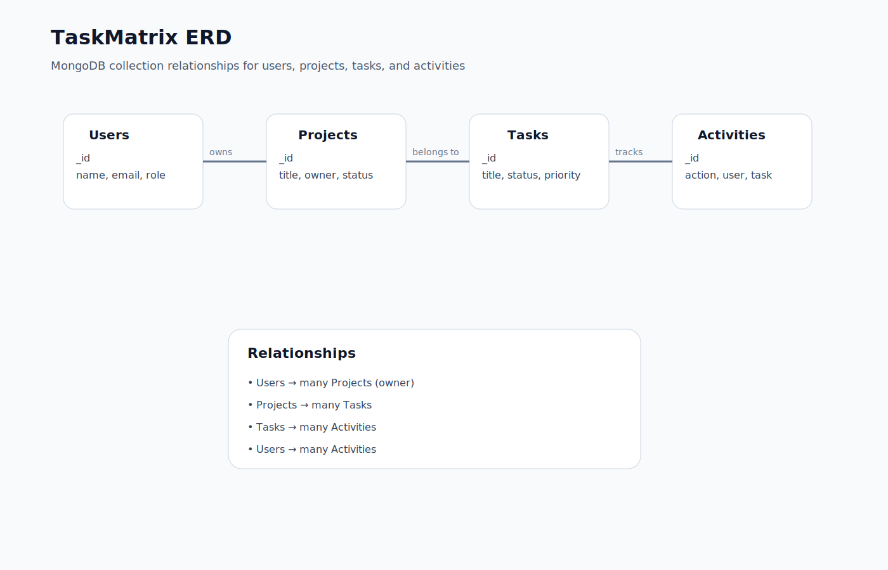
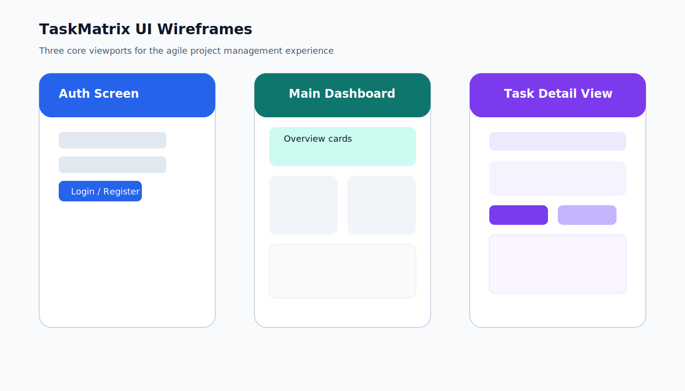

# TaskMatrix

## Project Name & High-Level Description
TaskMatrix is an agile project management platform engineered for software teams. It acts as a Jira/Asana-style workspace for creating projects, organizing tasks, tracking progress, and reviewing team activity.

## Repository
- Public GitHub repository: `prodesk-capstone-taskmatrix`
- This repository contains the fullstack PRD, design artifacts, architecture diagrams, and implementation scaffolding.

## Designated Track
- Fullstack

## Tech Stack
- Frontend: React, Vite, CSS
- Backend: Node.js, Express
- Database: MongoDB + Mongoose
- Authentication: JSON Web Tokens (JWT)
- API Communication: Axios
- Version Control: Git + GitHub

## Core Features (Prioritized)
1. User authentication and role-based access
2. Project creation, viewing, and deletion
3. Task creation, editing, status updates, and deletion
4. Task status, priority, and project assignment tracking
5. Dashboard summaries for projects, tasks, and completion status
6. Activity feed for recent updates
7. Role-based restrictions and secure API access
8. Future: Kanban board, deadline reminders, real-time collaboration

## Phase Deliverables
### Phase 1: Repository & PRD (P0 - Mandatory)
- Repository created as `prodesk-capstone-taskmatrix`
- Comprehensive `README.md` acting as the PRD
- Explicit statements for project name, track, tech stack, and core features

### Phase 2: UI/UX Wireframes (P1 - Priority)
- Visual layouts mocked before implementation
- Minimum of 3 core screens documented:
  - Authentication screen
  - Main dashboard
  - Tasks / detail view
- Design artifacts are included in the repository docs folder

### Phase 3: System Architecture Diagrams (P2 - Advanced)
- Fullstack ERD diagrams map MongoDB collections and relationships
- Exported diagrams are embedded in this README
- Key collections: Users, Projects, Tasks, Activities

## Product Requirements Document (PRD)
### Problem Statement
Software teams need a modern and lightweight system to organize work, assign responsibility, and monitor delivery without relying on bloated enterprise tools.

### Target Users
- Project managers
- Developers
- Team members
- Stakeholders reviewing progress

### User Stories
- As a team lead, I want to create projects and assign tasks so work is organized.
- As a developer, I want to update task status so progress is visible.
- As a stakeholder, I want to view dashboard summaries so I can quickly understand team progress.
- As an operations user, I want to see recent activity so I can audit changes.

### Functional Requirements
- Users can register and log in securely.
- Users can create, read, update, and delete projects.
- Users can create, read, update, and delete tasks.
- Users can assign task status, priority, and project context.
- Dashboard shows task counts, completion metrics, and recent tasks.
- Activity records capture important system updates.

## UI/UX Wireframes
The wireframe mockups for the core screens are stored in the repository under the `docs` folder.

- Auth Screen
- Main Dashboard
- Task Detail View

Figma Link: https://www.figma.com/

## System Architecture Diagrams
### Entity Relationship Diagram (ERD)

### Wireframe Mockup

## Project Structure
- `client/`: React frontend
- `server/`: Express backend and MongoDB integration

## Future Enhancements
- Drag-and-drop Kanban board
- Deadline reminders and cron-based notifications
- Advanced role management and permissions
- Real-time collaboration updates
